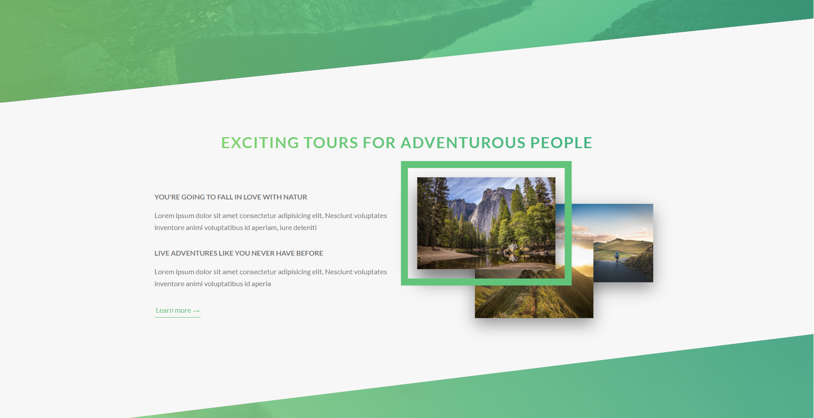
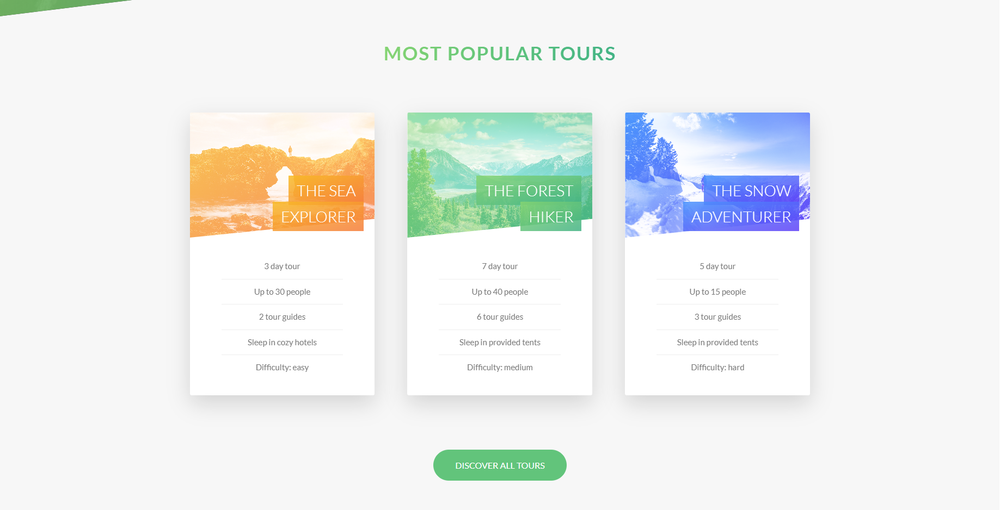

# Animated Landing Page

This is a beautifully designed landing page with smooth animations, built using **HTML and Sass**. It provides an engaging user experience with modern styling and interactive elements.

## 🚀 Features

- **Fully Responsive Design** – Optimized for all devices.
- **Smooth Animations** – Eye-catching transitions and effects.
- **Modern UI** – Clean and elegant design.
- **Optimized Performance** – Efficient and lightweight code structure.

## 🛠️ Tech Stack

- **HTML** – Structure and content
- **Sass (SCSS)** – Enhanced styling with variables and mixins

## 📸 Screenshots




## 📂 Project Setup

1. Clone the repository:
   ```bash
   git clone https://github.com/yourusername/Natours.git
   ```
2. Navigate to the project directory:
   ```bash
   cd Natours
   ```
3. Compile Sass (if needed):
   ```bash
   sass styles/main.scss styles/main.css
   ```
4. Open the `index.html` file in your browser.

## 📬 Contact

For any inquiries or improvements, feel free to reach out at **ahmedmlotfi@outlook.com**.

---

Made with ❤️ by **Ahmed Lotfi**
